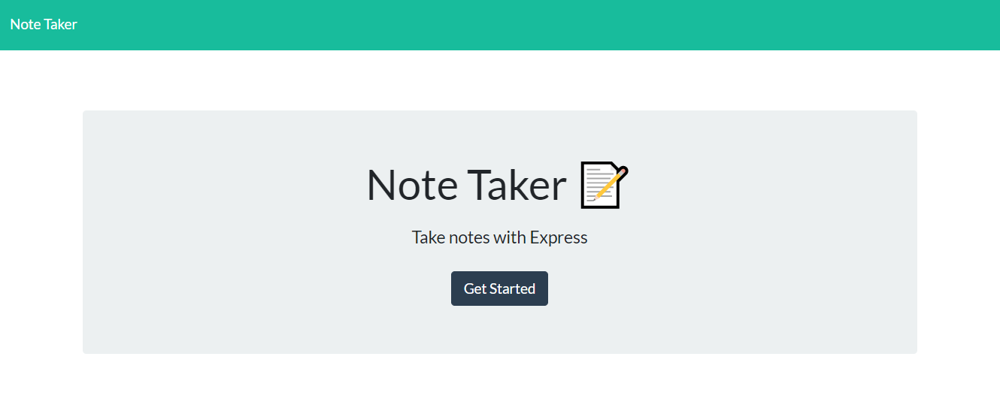
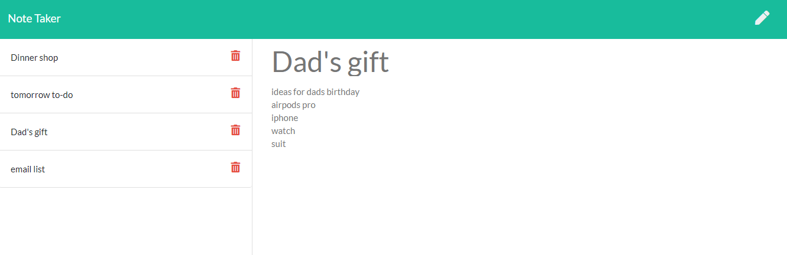

# Note Taker
---
  ## Description
  > This app allow users to create and store notes in app for their own use.

---
  ## Getting Started
  - [Installation](##Installation)
  - [Contribute](##Contribute)
  - [Test](##Test)
  - [Usage](##Usage)
  - [Questions](##Questions)
  - [Licenses](##Licenses)

---
  ## Installation
  
  ### Install
  To install, please type following command
  <pre> # Install dependencies
  npm install </pre>

  ### Clone
  > https://github.com/misterjaykay/note-taker

---
  ## Test
  <pre> # NPM
  npm test </pre>

--- 
  ## Usage
  To run this app, be sure to install node.js onto your code editor.

---
## Preview

--- 
  ## Contribute to "Note Taker"

  ### How to contribute

  Please fork this repository.

---
  ## Questions

  ### Github Profile
  [Visit My Repo](https://github.com/misterjaykay)

  ### E-mail
  Please Email at misterjaykay@gmail.com

---
  ## Licenses
  None